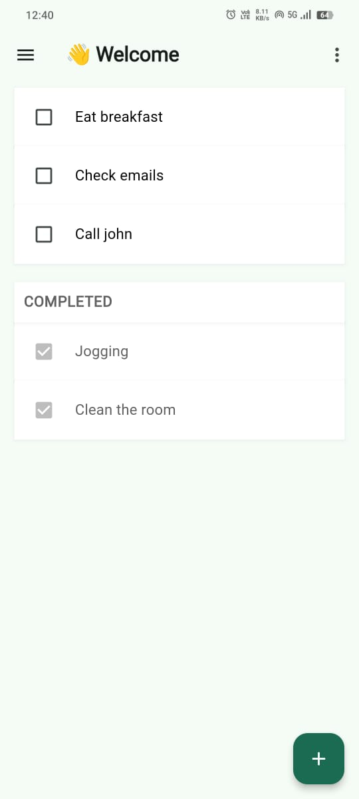

# ToDo App

This is a simple ToDo application built using Flutter. The app supports adding, editing, and deleting tasks. It follows the MVVM  architecture pattern and uses Cubit for state management.

## Screenshots

   
